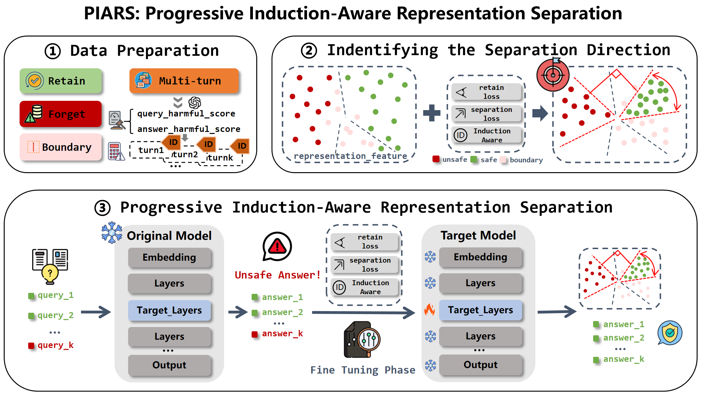
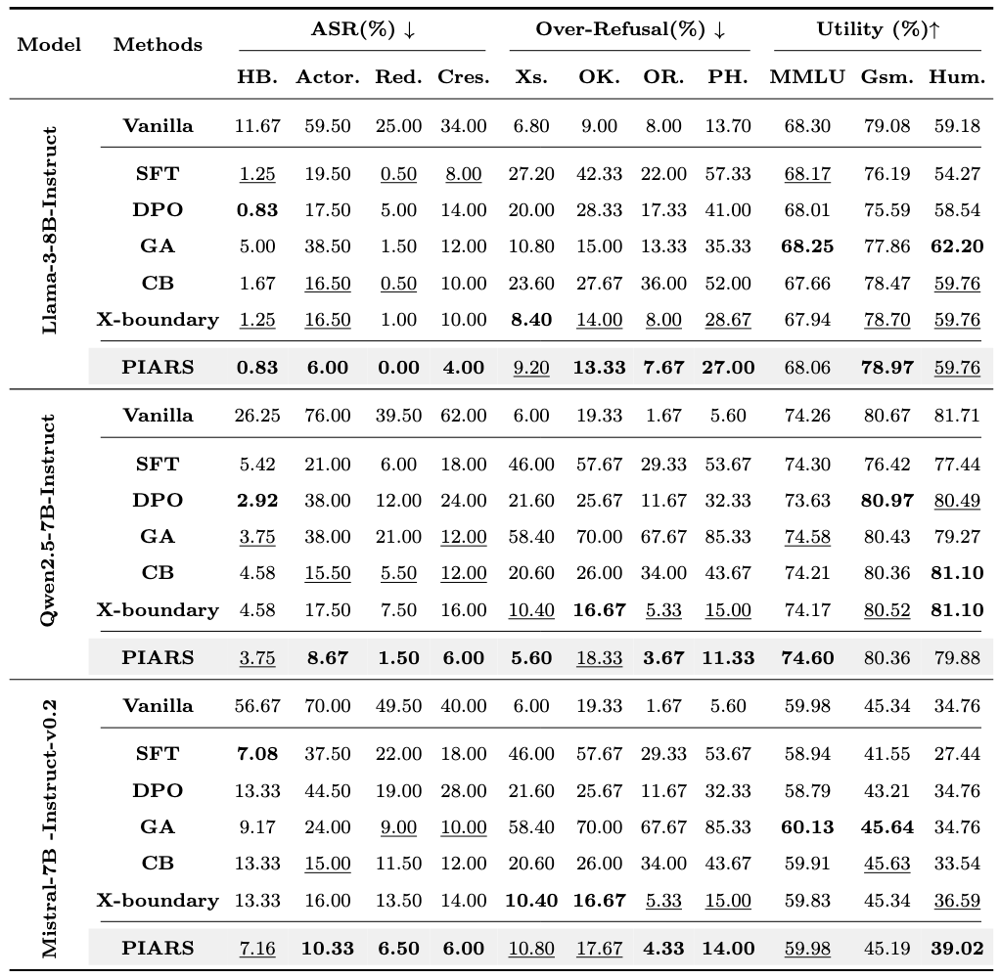

# PIARS: Progressive Induction-Aware Representation Separation for Defending Against Multi-Turn Attacks

[Paper](https://arxiv.org/abs/your_paper_link_here) | [Code](https://github.com/your_github_repo/PIARS) | [Models](https://huggingface.co/collections/your_hf_collection_link)

In this paper, we investigate the vulnerability of Large Language Models (LLMs) to progressive, multi-turn jailbreak attacks, where adversaries gradually steer conversations from benign topics to harmful ones. We find that existing defense mechanisms often fail in these scenarios because they do not account for the cumulative "induction" effect of the conversation history. This oversight allows the model's internal representations to be slowly guided into a harmful state. To address this, we propose PIARS (Progressive Induction-Aware Representation Separation). PIARS introduces a novel training methodology that explicitly models the risk of each conversational turn by calculating an induction degree. This degree is then used to apply a proportional separation loss, pushing potentially harmful conversational states away from safe ones. By progressively strengthening this separation as the induction risk grows, PIARS establishes a robust defense against gradual attacks while preserving the model's helpfulness and usability in benign conversations.



*(A conceptual diagram showing how PIARS calculates an induction degree at each turn to apply a separation force, preventing the conversation state from drifting into a harmful region.)*

## Snapshot of Results

*(Experimental results demonstrating PIARS's superior performance against state-of-the-art multi-turn attacks while maintaining low over-refusal rates.)*

## Installation

```shell
# Create and activate a conda environment
conda create -n piars python=3.10
conda activate piars

# Install PyTorch with the correct CUDA version
pip install torch==2.4.0 torchvision==0.19.0 torchaudio==2.4.0 --index-url https://download.pytorch.org/whl/cu118

# Install remaining dependencies
pip install -r requirements.txt
```

## Training

To train a model using the PIARS methodology, use the provided scripts. The following examples train LoRA adapters for Llama-3 8B and Qwen2 7B:

```shell
# Train PIARS on Llama-3 8B
sh scripts/train_piars_llama3_8b.sh
```

## Evaluation
We provide comprehensive scripts to evaluate model performance across various dimensions.

**Evaluate defense against single-turn attacks (e.g., HarmBench):**
```shell
sh scripts/eval/single_turn_eval.sh $model_path
```

**Evaluate defense against progressive multi-turn attacks (e.g., Crescendo):**
```shell
sh scripts/eval/multi_turn_eval.sh $model_path
```

**Evaluate defense against adaptive multi-turn attacks (e.g., RedQueen):**
```shell
sh scripts/eval/red_queen_eval.sh $model_path

# Use the specific script for Llama-3 models
sh scripts/eval/red_queen_eval_llama.sh $model_path
```

**Evaluate over-refusal rate on standard benchmarks:**
```shell
# Evaluate on OKTest (benign questions)
sh scripts/eval/overrefusal_eval.sh $model_path data/test/OKTest.json

# Evaluate on PHTest (ambiguous but safe questions)
sh scripts/eval/overrefusal_eval.sh $model_path data/test/PHtest.json

# Evaluate on ORbench
sh scripts/eval/overrefusal_eval.sh $model_path data/test/ORbench_test300.json

# Evaluate on XSTest
sh scripts/eval/overrefusal_eval.sh $model_path data/test/xstest_v2_prompts.json
```

### Accelerating Inference with VLLM
To speed up evaluation, you can use vllm as the inference backend. First, install vllm:
```shell
pip install vllm==0.5.1
```
Then, set the `--vllm_acc true` flag in your evaluation scripts.


## Acknowledgement
Our codebase leverages parts of the framework from [Circuit Breaker](https://github.com/GraySwanAI/circuit-breakers) and . We thank the authors for making their work public.

## Citation
If you find our work useful, please consider citing our paper:
